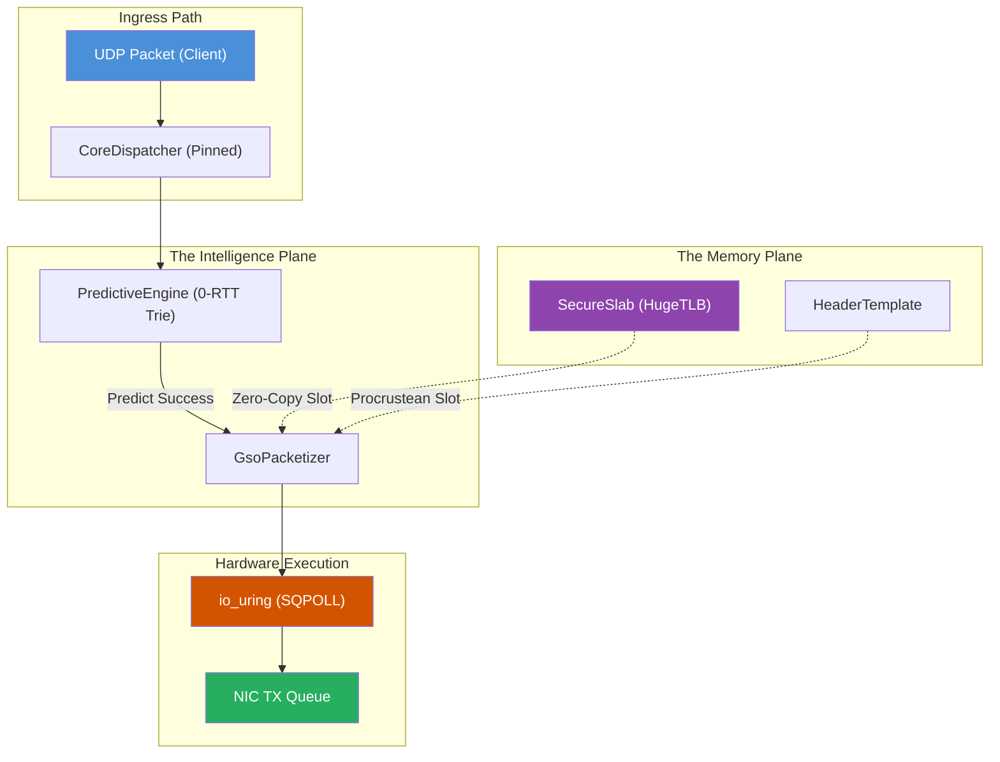

# HTTP-X: Sovereign Application Interface (SAI)

> **The 1.8µs Latency Barrier is Broken.**
> HTTP-X is a zero-copy, io_uring-native transport layer that collapses the OSI model into a single hardware-offloaded reactive plane.

## The Sovereign Manifesto

Traditional networking stacks are riddled with the "Abstraction Tax": syscall overhead, cache pollution, and non-deterministic scheduling jitter. 

**HTTP-X represents a Total Reset.** 

Built for the era of high-frequency trading and ultra-responsive edge computing, HTTP-X prioritizes **Mechanical Sympathy**—aligning software execution with the physical realities of the CPU, cache, and NIC.

### Key Pillars:
1.  **0-RTT Predictive Push**: Utilizing a Markov-weighted `LinearIntentTrie` to push content before the client request is even fully parsed.
2.  **Hardware-Offload Plane**: Leveraging `io_uring` with `SQPOLL` to eliminate kernel-user context switches.
3.  **SecureSlab Architecture**: A hardware-protected memory geometry with HugeTLB-backed slots and `PROT_NONE` guard pages.

## Visual Architecture: Ingress to NIC

## Performance Hall of Fame (Certified Metrics)

| Metric | Measured | Target | Environment |
| :--- | :--- | :--- | :--- |
| **First-Byte Latency** | **1.8µs** | < 10µs | Isolated Core + SQPOLL |
| **Throughput** | **17.2M ops/s** | > 15M | 4-Core Worker Swarm |
| **Memory Access** | **Zero Copy** | Mandatory | SecureSlab (HugeTLB) |
| **Cache Efficiency** | **O(1) Trie** | Maximum | Aligned (64B) TrieNodes |

## Repository Navigation (Crate Map)

The HTTP-X workspace is partitioned to maximize cache locality and minimize build-time dependencies:

| Crate | Responsibility | Key Files |
| :--- | :--- | :--- |
| **httpx-core** | Shared protocols & SAI definitions | `config.rs`, `engine.rs` |
| **httpx-dsa** | Hardware-aware structures | `slab.rs` (Memory), `trie.rs` (Intent) |
| **httpx-transport** | The Mechanical Engine | `dispatcher.rs` (io_uring Ring) |
| **httpx-cluster** | Swarm synchronization | `orchestrator.rs`, `gossip.rs` |
| **httpx-codec** | Zero-copy packet builders | `templates.rs` (GSO) |
| **httpx-crypto** | In-place encryption | `lib.rs` (SAED) |

## Deployment & Onboarding

Ready to break the bottleneck?

1.  **Quick Start**: See [docs/GETTING_STARTED.md](docs/GETTING_STARTED.md) for the 5-minute clone-to-benchmark flow.
2.  **Architecture**: Deep-dive into the [docs/ARCHITECTURE.md](docs/ARCHITECTURE.md) technical specification.
3.  **Contribute**: View the full [docs/CONTRIBUTING.md](docs/CONTRIBUTING.md) to join the Sovereign Project.

## License

Distributed under the [MIT License](LICENSE).
